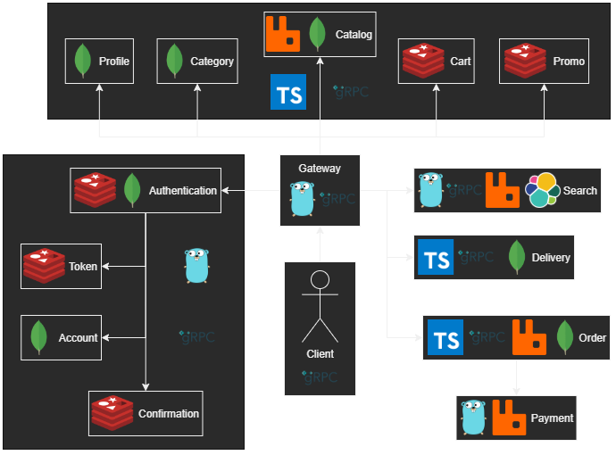

# E-commerce backend

> This is an overview of the project. Go to the submodule to see the implementation details of a specific service.

E-commerce backend based on the gRPC microservices ecosystem and Clean Architecture principles, includes: _authentication, shopping, ordering, promo usage, delivery, shipping tracking, etc_

____

[Try plugin for Intellij, make it easy to generate Protobuf code](https://plugins.jetbrains.com/plugin/21792-protobuf-blueprint)

## Design features:

- Multilanguage: *Golang, TypeScript*
- *JWT* authentication
- *gRPC* based microservices
- *gRPC* based gateway

### Authentication & authorization:

- [Authentication](https://github.com/numq/ecommerce-backend/tree/master/authentication)
- [Token](https://github.com/numq/ecommerce-backend/tree/master/token)
- [Account](https://github.com/numq/ecommerce-backend/tree/master/account)
- [Confirmation](https://github.com/numq/ecommerce-backend/tree/master/confirmation)

### Microservice infrastructure:

- [Gateway](https://github.com/numq/ecommerce-backend/tree/master/gateway)

### Domain specific services:

##### User related:

- [Profile](https://github.com/numq/ecommerce-backend/tree/master/profile)

##### Product related:

- [Category](https://github.com/numq/ecommerce-backend/tree/master/category)
- [Catalog](https://github.com/numq/ecommerce-backend/tree/master/catalog)
- [Search](https://github.com/numq/ecommerce-backend/tree/master/search)
- [Promo](https://github.com/numq/ecommerce-backend/tree/master/promo)

##### Purchase related:

- [Cart](https://github.com/numq/ecommerce-backend/tree/master/cart)
- [Payment](https://github.com/numq/ecommerce-backend/tree/master/payment)
- [Order](https://github.com/numq/ecommerce-backend/tree/master/order)

##### Shipping related:

- [Delivery](https://github.com/numq/ecommerce-backend/tree/master/delivery)
