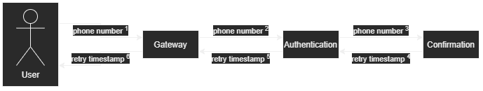
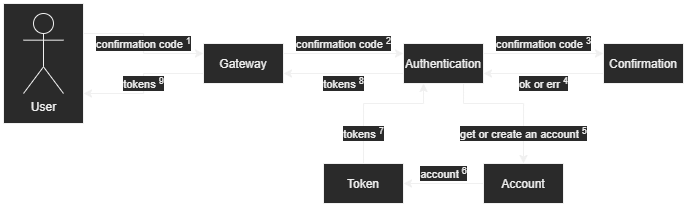
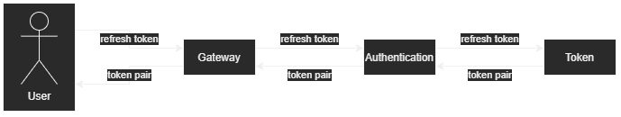

# Authentication microservice

OTP(one time password) based JWT(access & refresh tokens) authentication

[Back to overview]("https://github.com/numq/ecommerce-backend")

## Tech:

- **Go**
- **gRPC**
- **Protobuf**
- **Viper**

## Authentication:

### First stage

### Second stage

## Refresh tokens:

